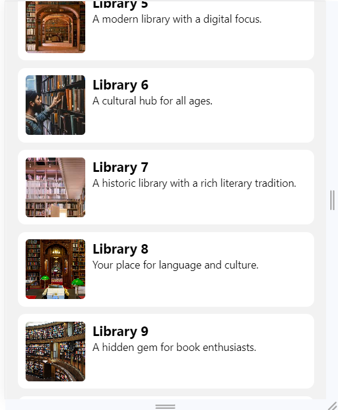

# Book Nook: Local Library Explorer

## Description

Welcome to the Book Nook: Local Library Explorer! This mobile app is your gateway to discovering and exploring local libraries in your area. With a wide range of features, it allows you to search for libraries, view their details, and even bookmark your favorites for easy access. This README.md provides an overview of the project and instructions on how to set up and run the app.

## Project Links

* Github- [Book Nook on GitHub](https://github.com/saurabhkumarr99/Book-Nook)

## Table of Contents

- [Features](#features)
- [Getting Started](#getting-started)
- [Usage](#usage)
- [Code Structure](#code-structure)
- [Screenshots](#screenshots)
- [Author](#Author)

## Features

- **Library Search:** Easily search for local libraries based on their name or location.
- **Library Details:** View comprehensive information about libraries, including address, operational hours, history, and available services.
- **Sorting Options:** Sort libraries by popularity or proximity to your location.
- **Bookmark Libraries:** Save your favorite libraries for quick access.
- **Responsive Design:** Enjoy a seamless user experience on both iOS and Android devices.

## Getting Started

### Prerequisites

- Node.js and npm (Node Package Manager) installed on your computer.
- Node.js: [Download and Install Node.js](https://nodejs.org/)

Follow these steps to run the Blog App locally:

1. **Unzip the Book Nook App:**

2. **Navigate to the project directory:**

   ```bash
   cd BookNook
   ``` 

2. **Install Dependencies:**

   ```bash
   npm install
   ``` 

3. **Run:**

   ```bash
      npx expo start
   ``` 


## Usage

- **Search Libraries**: Use the search bar to look for libraries by name or location.
- **Library Details**: Click on a library to view detailed information, including address, operational hours, history, and services.
- **Sort Libraries**: Sort libraries by popularity or proximity to your location.
- **Bookmark Libraries**:
## Code Structure

The project follows a structured directory layout for better organization:

- **allComponents/**: 
  - **data/**: Dummy Data.
    - `Libraries.js`: Dummy Data.
  - `AppNavigator.js/`
  - `BoomarkContext.js`
  - `LibrarayDetailScreen.js`
  - `LibrarayListScreen.js`

- **ScreenShots**: Folder conatining screenshots here.

  - **assets/**: Images, styles, and other assets.
    - `images/`: Folder containing project images.
  - `App.js`: The main application file that sets up routing and renders components.

- `package.json`: The project dependencies and scripts configuration.

- `README.md`: This file, which provides an overview of the project's structure and usage instructions.

## Screenshots

<p align="center">
  
  
  
  
  
  
</p>


## Author

- SAURABH KUMAR RAI

